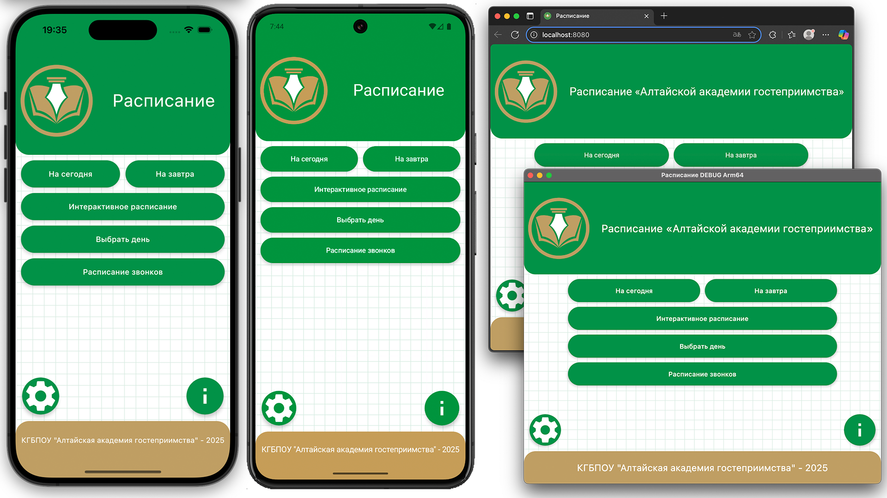

<h1 align="center">
    
    
Schedule AAG

    

    

        
    

</h1> 

---

## Поддерживаемые платформы:
| Платформа                                                               | Минимальная версия                              |
|-------------------------------------------------------------------------|-------------------------------------------------|
| [Web](https://p0mid00r.github.io/)                                      | Браузеры с поддержкой WasmGC (Safari iOS 18.2+) |
| [Android](https://www.rustore.ru/catalog/app/com.pomidorka.scheduleaag) | Android 8.0+                                    |
| iOS                                                                     | iOS 13+                                         |
| Windows                                                                 | Windows 10,11 (x86-64, arm64)                   |
| Mac                                                                     | macOS 12 x64, macOS 13 arm64                    |
| Linux                                                                   | Ubuntu 20.04 (x86-64, arm64)                    |

Это мультиплатформенный Kotlin проект, ориентированный на Android, iOS, Desktop, Web.

Узнайте больше о [Kotlin Multiplatform](https://www.jetbrains.com/help/kotlin-multiplatform-dev/get-started.html),
[Compose Multiplatform](https://github.com/JetBrains/compose-multiplatform/#compose-multiplatform),
[Kotlin/Wasm](https://kotl.in/wasm/)…